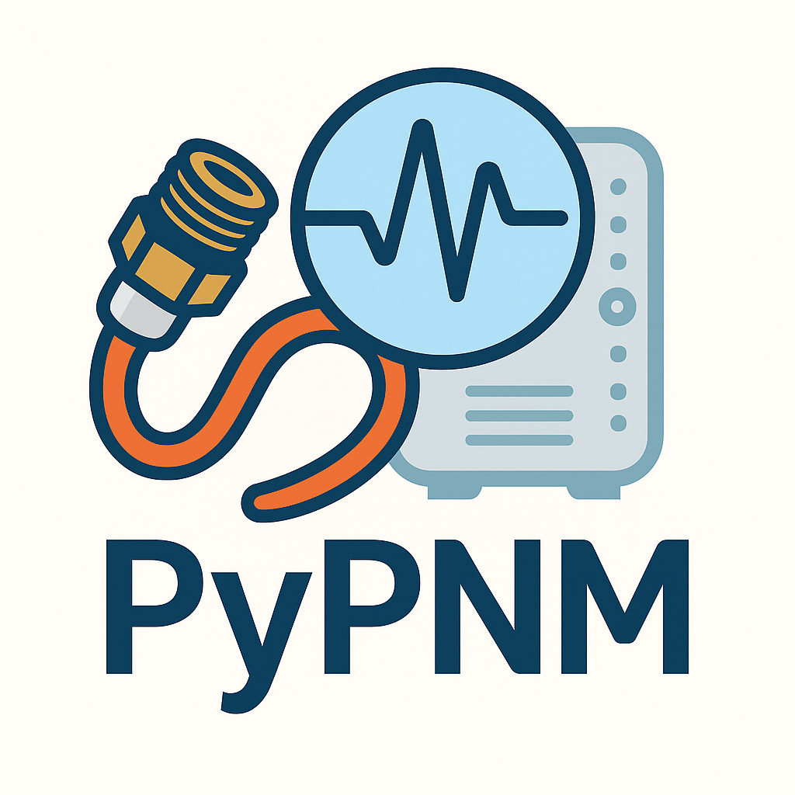

<p align="center">
  <a href="docs/index.md">
    <picture>
      <source srcset="docs/images/logo/pypnm-dark-mode-hp.png" media="(prefers-color-scheme: dark)" />
      
    </picture>
  </a>
</p>

# PyPNM - Proactive Network Maintenance Toolkit

[](https://github.com/mgarcia01752/PyPNM/tags)
[](https://github.com/mgarcia01752/PyPNM/actions/workflows/daily-build.yml)
[](./LICENSE)
[](https://www.python.org/)

PyPNM is a DOCSIS 3.x/4.0 Proactive Network Maintenance toolkit for engineers who want repeatable, scriptable visibility into modem health. It can run purely as a Python library or as a FastAPI web service for real-time dashboards and offline analysis workflows.

## Key Features

- **Structured SNMP integration**  
  Poll DOCSIS cable modems for RxMER, OFDM/OFDMA profiles, spectrum, upstream pre-EQ, and related telemetry.

- **Binary capture decoding**  
  Retrieve modem-generated PNM files (TFTP or SNMP) and decode them into typed models instead of ad-hoc byte parsing.

- **FastAPI REST service**  
  Expose capture, analysis, and file-management APIs for dashboards, automation pipelines, CI, or remote tools.

- **OFDM & OFDMA utilities**  
  Channel estimation, FEC summary, tap-delay and group-delay helpers, constellation views, and related DSP utilities.

- **Analysis helpers**  
  Shannon capacity, SNR / margin deltas, basic statistics, and reusable primitives for more advanced analysis.

- **Extensible framework**  
  Add new PNM file types, analysis routines, and endpoints without rewriting the core plumbing.

- **CLI tools**  
  Scriptable helpers for capture orchestration, file management, and repeatable lab workflows.

## Prerequisites

### Operating Systems

Linux, validated on:

- Ubuntu 22.04 LTS
- Ubuntu 24.04 LTS

Other modern Linux distributions may work but are not yet part of the test matrix.

### Shell Dependencies

```bash
sudo apt update
sudo apt install -y git
```

Python and the remaining dependencies are handled by the installer.

## Getting Started

### 1) Clone

```bash
git clone https://github.com/mgarcia01752/PyPNM.git
cd PyPNM
```

### 2) Install

The installer sets up system prerequisites (where possible), creates a virtual environment, and installs PyPNM in editable mode:

```bash
./install.sh
```

Show installer options:

```bash
./install.sh --help
```

Demo-mode install (pre-configured with sample data and demo paths):

```bash
./install.sh --demo-mode
```

Revert to production settings (restore your original `system.json`):

```bash
./install.sh --production
```

Use a custom virtual environment directory:

```bash
./install.sh --demo-mode .env-demo
```

### 3) Activate The Virtual Environment

If you did not already create or activate a venv:

```bash
python3 -m venv .env
source .env/bin/activate
```

### 4) Configure (Quick Setup)

You will need:

- Cable Modem (CM) MAC address and IP address  
- SNMPv2c write community string  
- TFTP server IP (IPv4/IPv6) reachable by both the CM and PyPNM  
- A retrieval method for PNM files from the TFTP server  

See: [System Configuration](docs/api/fast-api/pypnm/system/system_config.md)

In **demo mode**, these paths are redirected to demo directories so you can exercise the analysis stack using pre-captured PNM files without talking to a live modem.

### 5) Run The FastAPI Service

Show help:

```bash
pypnm --help
```

HTTP (default: `http://127.0.0.1:8000`):

```bash
pypnm &
```

HTTPS example:

```bash
pypnm --host 0.0.0.0 --port 443 --ssl --cert ./certs/cert.pem --key ./certs/key.pem &
```

Development hot-reload:

```bash
pypnm --reload &
```

### 6) (Optional) Serve The Documentation

HTTP (default: `http://127.0.0.1:8001`):

```bash
mkdocs serve &
```

### 7) Explore The API

- Swagger UI: [http://localhost:8000/docs](http://localhost:8000/docs)  
- ReDoc: [http://localhost:8000/redoc](http://localhost:8000/redoc)  
- MkDocs docs: [http://localhost:8001](http://localhost:8001)  
- Postman download: [https://www.postman.com/downloads/](https://www.postman.com/downloads/)

Tip: Postman is recommended for larger or nested JSON payloads and for collecting repeatable test collections and visualizations with Postman-AI assistance.

## API Documentation Quick Links

- [Docs index](./docs/index.md)  
- [FastAPI reference](./docs/api/fast-api/index.md)  
- [Python API reference](./docs/api/python/index.md)

## SNMP Notes

- SNMPv2c is supported.  
- SNMPv3 is currently stubbed and not yet supported.

## CableLabs Specifications & MIBs

- [CM-SP-MULPIv3.1](https://www.cablelabs.com/specifications/CM-SP-MULPIv3.1)  
- [CM-SP-CM-OSSIv3.1](https://www.cablelabs.com/specifications/CM-SP-CM-OSSIv3.1)  
- [CM-SP-MULPIv4.0](https://www.cablelabs.com/specifications/CM-SP-MULPIv4.0)  
- [CM-SP-CM-OSSIv4.0](https://www.cablelabs.com/specifications/CM-SP-CM-OSSIv4.0)  
- [DOCSIS MIBs](https://mibs.cablelabs.com/MIBs/DOCSIS/)

## PNM Architecture & Guidance

- [CM-TR-PMA](https://www.cablelabs.com/specifications/CM-TR-PMA)  
- [CM-GL-PNM-HFC](https://www.cablelabs.com/specifications/CM-GL-PNM-HFC)  
- [CM-GL-PNM-3.1](https://www.cablelabs.com/specifications/CM-GL-PNM-3.1)

## License

[`MIT LICENSE`](./LICENSE)

## Maintainer

Maurice Garcia

- [Email](mailto:mgarcia01752@outlook.com)  
- [LinkedIn](https://www.linkedin.com/in/mauricemgarcia/)
